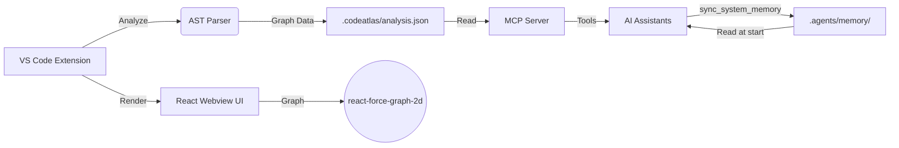

# 🗺️ CodeAtlas

**Lightweight AI-powered source code analysis extension for VS Code / Cursor**


CodeAtlas helps you visualize, understand, and navigate your codebase using interactive network graphs, AI-powered insights, and **persistent AI memory via MCP**.

## Features

### 🌐 VS Code Extension
- **Interactive Force-Directed Graph**: Visualize your code's architecture and dependencies in real-time
- **AST-Based Code Analysis**: Deep semantic understanding of TypeScript, JavaScript, Python, and PHP files
- **AI-Powered Insights**: Get actionable recommendations, security audits, and maintainability scores
- **AI Copilot Chat**: Talk to your codebase and ask complex architectural questions using natural language
- **Entity & Relationship Overview**: See clear counts and statistics of all modules, classes, functions, and their connections
- **Click-to-Navigate**: Jump straight from graph nodes to the corresponding source code lines
- **Auto-Reanalyze on Save**: The graph updates automatically as you write code
- **Search & Filter**: Quickly find specific entities and filter node types to declutter large graphs

### 🧠 MCP Server — AI System Memory (NEW in v1.4.0)

CodeAtlas includes an **MCP (Model Context Protocol) server** that gives AI assistants (Gemini, Claude, Cursor, etc.) deep understanding of your codebase — and **persistent memory between conversations**.

| Tool | Description |
|------|-------------|
| `list_projects` | List all analyzed projects |
| `get_project_structure` | Get all modules, classes, functions, variables |
| `get_dependencies` | Import/call/containment relationships |
| `search_entities` | Fuzzy search by entity name with relationships |
| `get_file_entities` | All entities in a specific file |
| `get_insights` | AI-generated code quality insights |
| `generate_system_flow` | Auto-generate Mermaid architecture diagrams |
| `sync_system_memory` | Create/update `.agents/memory/` — AI's long-term memory |
| `trace_feature_flow` | Trace a feature's flow through the codebase |

**How AI Memory works:**
```
Conversation 1 → AI writes code → sync_system_memory → .agents/memory/ updated
                                                              │
Conversation 2 → AI reads .agents/memory/ → knows full system flow instantly
```

## Quick Start

### VS Code Extension

1. Install from the VSIX package or VS Code Marketplace
2. Open a project workspace
3. Open the Command Palette (`Ctrl+Shift+P`) and run **CodeAtlas: Analyze Project**
4. Explore the interactive graph and ask AI for insights!

### MCP Server Setup

Add to your editor's MCP config:

**Gemini CLI / Antigravity** (`.gemini/settings.json`):
```json
{
  "mcpServers": {
    "codeatlas": {
      "command": "npx",
      "args": ["tsx", "/path/to/CodeAtlas/index.ts"]
    }
  }
}
```

**Cursor** (`.cursor/mcp.json`):
```json
{
  "mcpServers": {
    "codeatlas": {
      "command": "npx",
      "args": ["tsx", "/path/to/CodeAtlas/index.ts"]
    }
  }
}
```

**Claude Code CLI**:
```bash
claude mcp add codeatlas -- npx tsx /path/to/CodeAtlas/index.ts
```

### AI Memory Setup

Copy rule templates to your project so AI automatically uses CodeAtlas:

```bash
mkdir -p /path/to/your-project/.agents/rules/
cp /path/to/CodeAtlas/docs/rules-template/*.md /path/to/your-project/.agents/rules/
```

Then run `sync_system_memory` once to generate the initial memory snapshot.

> 📖 Full setup guide: [docs/AI-MEMORY-SETUP.md](docs/AI-MEMORY-SETUP.md)

## Supported Languages

| Language | Parser | Features |
|----------|--------|----------|
| TypeScript / JavaScript | `@typescript-eslint/typescript-estree` | Full AST: imports, classes, functions, variables, calls |
| Python | Regex-based | Classes, functions, variables, imports, calls |
| PHP | Regex-based | Classes, interfaces, traits, enums, functions, properties, constants, `use` statements |
| Blade Templates | Regex-based | `@extends`, `@include`, `@component`, `<x-component>` |

## Architecture



## Tech Stack

| Component | Technology |
|---|---|
| Extension Host | VS Code API, TypeScript |
| AST Parser | `@typescript-eslint/typescript-estree`, Python & PHP regex parsers |
| MCP Server | `@modelcontextprotocol/sdk`, Zod |
| Webview UI | React, Vite |
| Graph Visualization | `react-force-graph-2d` |
| Build Tooling | `esbuild`, `tsc`, `vsce` |

## Contributing

We welcome contributions! To get started:

1. Fork the repository and create a new branch
2. Run `npm install` to install dependencies
3. Run `npm run build` to build the extension and webview
4. Press `F5` in VS Code to launch the Extension Development Host
5. Submit a PR!

## License

This project is licensed under the [MIT License](LICENSE).
