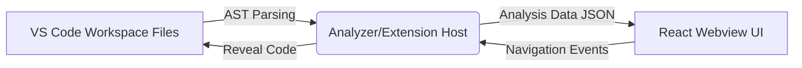

# 🗺️ CodeAtlas

Lightweight AI-powered source code analysis extension for VS Code / Cursor

  


## Features

- **Interactive Force-Directed Graph:** Visualize modules, functions, classes, and their relationships (imports, calls) in real-time.
- **AI-Powered Code Insights:** Identify "God objects", high-coupling, and other structural or architectural issues immediately.
- **AI Copilot Chat:** Have natural language queries about your project structure. Ask about dependencies, components, or circular references.
- **Entity & Relationship Overview:** Quick stats about your codebase scope.
- **Click-to-Navigate:** Click directly on a graph node to instantly open the file and navigate to the code definition.
- **Ultra-lightweight:** Analyzes your AST directly without requiring any external databases or heavy servers.

## Installation

### From VSIX
1. Download the `.vsix` file from the [Releases](https://github.com/giauphan/CodeAtlas/releases) page.
2. Open VS Code / Cursor.
3. Go to the Extensions view (`Ctrl+Shift+X`).
4. Click the `...` menu and select "Install from VSIX...".
5. Select the downloaded `.vsix` file.

### From Source
```bash
git clone https://github.com/giauphan/CodeAtlas.git
cd CodeAtlas
npm install
npm run build
```
Then, press `F5` in VS Code to run the extension in the Extension Development Host.

## Usage

1. Open a TypeScript or JavaScript project workspace in VS Code.
2. Open the Command Palette (`Ctrl+Shift+P` or `Cmd+Shift+P` on Mac).
3. Type and select `CodeAtlas: Analyze Project`.
4. The extension will parse the codebase and open the CodeAtlas Insights panel.
5. Explore the interactive graph, review AI Insights in the left panel, or chat with the AI Copilot using the toggle button in the bottom right corner.

## Tech Stack

| Component | Technology |
|-----------|-----------|
| Extension | TypeScript, VS Code Extension API |
| Parser | `@typescript-eslint/typescript-estree` |
| Graph | `react-force-graph-2d` (Canvas/WebGL) |
| UI | React 18, Vite |
| Styling | CSS3, Glassmorphism |

## Architecture

The extension is separated into two main parts: the VS Code Extension Host and the React Webview UI.



## Contributing

Contributions are welcome! Please feel free to submit a Pull Request.

1. Fork the repository
2. Create your feature branch (`git checkout -b feature/AmazingFeature`)
3. Commit your changes (`git commit -m 'Add some AmazingFeature'`)
4. Push to the branch (`git push origin feature/AmazingFeature`)
5. Open a Pull Request

## License

This project is licensed under the MIT License - see the [LICENSE](LICENSE) file for details.
