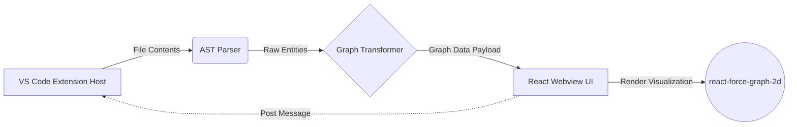

# 🗺️ CodeAtlas

**Lightweight AI-powered source code analysis extension for VS Code / Cursor**

CodeAtlas helps you visualize, understand, and navigate your codebase using interactive network graphs and AI-powered insights.

## Features

- 🌐 **Interactive Force-Directed Graph**: Visualize your code's architecture and dependencies in real-time.
- 🔍 **AST-Based Code Analysis**: Deep semantic understanding of TypeScript, JavaScript, and Python files.
- 🧠 **AI-Powered Insights**: Get actionable recommendations, security audits, and maintainability scores.
- 💬 **AI Copilot Chat**: Talk to your codebase and ask complex architectural questions using natural language.
- 📊 **Entity & Relationship Overview**: See clear counts and statistics of all modules, classes, functions, and their connections.
- 🎯 **Click-to-Navigate**: Jump straight from graph nodes to the corresponding source code lines.
- 🔄 **Auto-Reanalyze on Save**: The graph updates automatically as you write code.
- 🔎 **Search & Filter**: Quickly find specific entities and filter node types to declutter large graphs.
- ⚙️ **Configurable Settings**: Tweak analysis depth, auto-analysis behavior, and LLM configuration to your needs.

## Screenshots
*(Coming soon!)*

## Quick Start

1. Install from the VSIX package or VS Code Marketplace.
2. Open a project workspace.
3. Open the Command Palette (`Ctrl+Shift+P` / `Cmd+Shift+P`) and run **CodeAtlas: Analyze Project**.
4. Explore the interactive graph and ask AI for insights!

## Configuration

You can configure CodeAtlas via VS Code Settings (`Ctrl+,` or `Cmd+,`):

| Setting | Default | Description |
|---|---|---|
| `codeatlas.autoAnalyzeOnSave` | `true` | Automatically re-analyze the project when files are saved. |
| `codeatlas.anthropicApiKey` | `""` | Optional API key for Claude integration. Uses local models if left blank. |

*(More settings are coming soon as the extension expands)*

## Tech Stack

| Component | Technology |
|---|---|
| Extension Host | VS Code API, TypeScript |
| AST Parser | `@typescript-eslint/typescript-estree`, Python `ast` |
| Webview UI | React, Vite |
| Graph Visualization | `react-force-graph-2d` |
| Build Tooling | `esbuild`, `tsc`, `vsce` |

## Architecture

## Contributing

We welcome contributions! To get started:

1. Fork the repository and create a new branch.
2. Run `npm install` to install dependencies.
3. Run `npm run build` to build the extension and webview.
4. Press `F5` in VS Code to launch the Extension Development Host and debug your changes.
5. Submit a PR!

## License

This project is licensed under the [MIT License](LICENSE).
